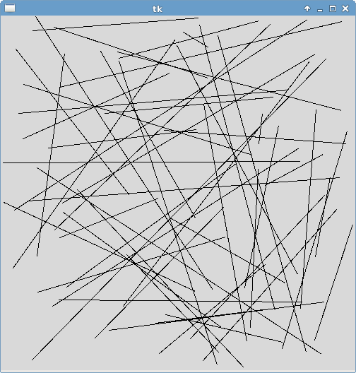
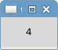
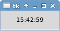

# Tkinter

## Online documentation

- http://effbot.org/tkinterbook/tkinter-index.htm
- http://infohost.nmt.edu/tcc/help/pubs/tkinter/web/index.html
- https://wiki.python.org/moin/TkInter

## Open source application examples

- IDLE (Python's official IDE)

## Books

- "Tkinter GUI Application Development HOTSHOT" Bhaskar Chaudhary (Packt Publishing Ltd) 2013
- "Programming Python (4th edition)" Mark Lutz (O'Reilly Media) 2010

## Widget list

- Label
- Button
- Frame
- Message
- Entry
- Checkbutton
- Radiobutton
- Scale
- PhotoImage
- BitmapImage
- Menu
- Menubutton
- Scrollbar
- Listbox
- Text
- Canvas
- OptionMenu
- PanedWindow
- LabelFrame
- Spinbox
- ScrolledText
- Dialog

## Files

## Add and remove widgets

## Animation canvas

## Animation canvas change colors

## Animation canvas clear all shapes and redraw

## Animation canvas rain

## Animation canvas update shapes instances coords

## Animation canvas update shapes instances itemconfig

## Animation canvas update shapes instances move

## Animation label

## Animation label clock

## Animation print

## Bind keyboard

## Bitmap image

## Button1

## Button2

## Button3

## Button and label

## Button color

## Button quit

## Button styles

## Cairo with pil

## Callback with arguments

## Canvas

## Canvas active

## Canvas chessboard

## Canvas clear all

## Canvas items config when mouse hover

## Canvas items events using current tag

## Canvas items events using ids

## Canvas items events using tags

## Canvas screencast

## Canvas screenshot

## Canvas tag all

## Canvas tag current

## Canvas tags

## Canvas transparent shape

## Checkbutton

## Color chooser

## Colors

## Container

## Display gif images

## Display png images

## Entry

## Event configure resize widget

## Event delete window

## Event keyboard

## Event keyboard meth2

## Event keyboard move shape in canvas

## Event mouse

## Event mouse draw polygon on canvas

## Fake table

## File dialog open directory

## File dialog open in entry

## File dialog open multiple file descriptor

## File dialog open multiple file path

## File dialog open single file descriptor

## File dialog open single file path

## File dialog save file descriptor

## File dialog save file path

## Font

## Font style

## Frame as separator

## Frame label

## Frame styles

## Frame with border

## Frame without border

## Full application template

## Fullscreen

## Geometry manager grid

## Geometry manager grid 2

## Geometry manager pack info

## Geometry manager pack left right

## Geometry manager pack short syntax

## Geometry manager pack test with 1 widget

## Geometry manager pack top bottom

## Get screens

## Get widget size

## Hello

## Image pil

## Keyboard events

## Keyboard events meth2

## Label

## Label justify

## Label style and font

## Label unicode

## Labelframe

## Listbox

## Listbox with object items

## Listbox with scrollbar

## Macosx startup focus workaround

## Macosx startup focus workaround v2

## Matplotlib canvas

## Matplotlib canvas using class

## Matplotlib canvas using class and toolbar

## Matplotlib canvas using class and toolbar and keyboard events

## Matplotlib canvas with animation

## Matplotlib canvas with navigation toolbar

## Matplotlib canvas with widgets interactions

## Matplotlib canvas without navigation toolbar

## Menu

## Menu checkbutton

## Menu enable disable items

## Menu popup

## Menu pulldown

## Menu radiobutton

## Menu toplevel

## Messagebox

## Minimal

## Multiple windows

## Optionmenu

## Pack info

## Pack short syntax

## Pack test with 1 widget

## Paned window horizontal

## Paned window vertical

## Photo image

## Photo image gif

## Photo image png

## Pil

## Radiobutton

## Radiobutton factorized

## Scale horizontal

## Scale vertical

## Scrolled text

## Show and resize image with pil

## Spinbox

## Spinbox range

## Spinbox tuple

## Tcl version

## Text

## Text insert

## Text readonly

## Title

## Tk version

## Tk version window

## Top level

## Ttk label

## Unicode

## Variables

## Widget get size

## Window always visible

## Window attributes topmost

## Window set fixed size

## Window set min size

## Window set size

## Window title

