# Tkinter Snippets

Tkinter is the Python's de-facto standard GUI (Graphical User Interface) package.

This directory contains 114 Tkinter snippets.
Many aspects of this package are tested here. 

Tkinter online documentation:

- http://effbot.org/tkinterbook/tkinter-index.htm
- http://infohost.nmt.edu/tcc/help/pubs/tkinter/web/index.html
- https://wiki.python.org/moin/TkInter

## Snippets list

### Add and remove widgets

<a href="https://github.com/jeremiedecock/snippets/blob/master/python/tkinter/python3/add_and_remove_widgets.py">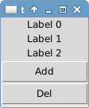</a>

### Animation canvas

<a href="https://github.com/jeremiedecock/snippets/blob/master/python/tkinter/python3/animation_canvas.py">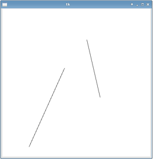</a>

### Animation canvas clear all shapes and redraw

### Animation canvas rain

<a href="https://github.com/jeremiedecock/snippets/blob/master/python/tkinter/python3/animation_canvas_rain.py">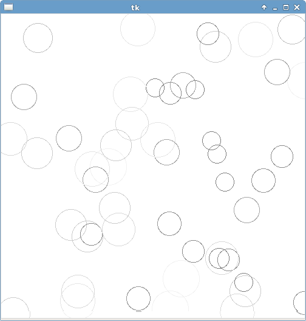</a>

### Animation canvas update shapes instances coords

### Animation canvas update shapes instances itemconfig

<a href="https://github.com/jeremiedecock/snippets/blob/master/python/tkinter/python3/animation_canvas_update_shapes_instances_itemconfig.py">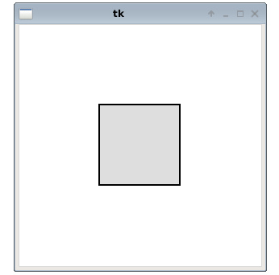</a>

### Animation canvas update shapes instances move

<a href="https://github.com/jeremiedecock/snippets/blob/master/python/tkinter/python3/animation_canvas_update_shapes_instances_move.py">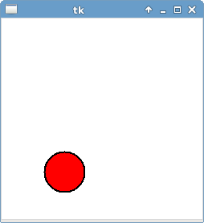</a>

### Animation label

### Animation label clock

### Animation print

<a href="https://github.com/jeremiedecock/snippets/blob/master/python/tkinter/python3/animation_print.py">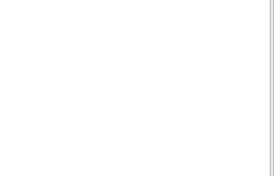</a>

### Bitmap image

<a href="https://github.com/jeremiedecock/snippets/blob/master/python/tkinter/python3/bitmap_image.py">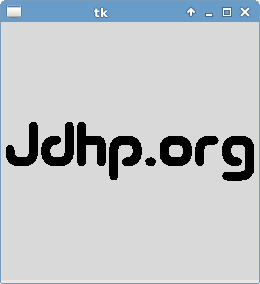</a>

### Button1

<a href="https://github.com/jeremiedecock/snippets/blob/master/python/tkinter/python3/button1.py">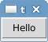</a>

### Button2

<a href="https://github.com/jeremiedecock/snippets/blob/master/python/tkinter/python3/button2.py">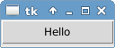</a>

### Button3

<a href="https://github.com/jeremiedecock/snippets/blob/master/python/tkinter/python3/button3.py">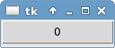</a>

### Button and label

<a href="https://github.com/jeremiedecock/snippets/blob/master/python/tkinter/python3/button_and_label.py">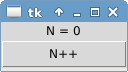</a>

### Button color

<a href="https://github.com/jeremiedecock/snippets/blob/master/python/tkinter/python3/button_color.py">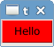</a>

### Button quit

<a href="https://github.com/jeremiedecock/snippets/blob/master/python/tkinter/python3/button_quit.py">button_quit.py</a>

### Button styles

<a href="https://github.com/jeremiedecock/snippets/blob/master/python/tkinter/python3/button_styles.py">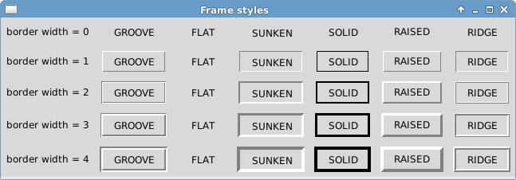</a>

### Cairo with pil

<a href="https://github.com/jeremiedecock/snippets/blob/master/python/tkinter/python3/cairo_with_pil.py">cairo_with_pil.py</a>

### Callback with arguments

<a href="https://github.com/jeremiedecock/snippets/blob/master/python/tkinter/python3/callback_with_arguments.py">callback_with_arguments.py</a>

### Canvas

<a href="https://github.com/jeremiedecock/snippets/blob/master/python/tkinter/python3/canvas.py">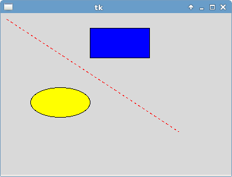</a>

### Canvas active

<a href="https://github.com/jeremiedecock/snippets/blob/master/python/tkinter/python3/canvas_active.py">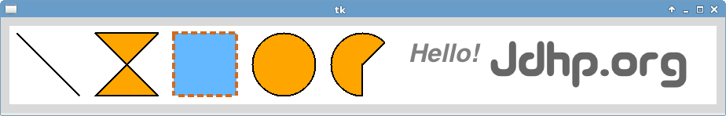</a>

### Canvas chessboard

<a href="https://github.com/jeremiedecock/snippets/blob/master/python/tkinter/python3/canvas_chessboard.py">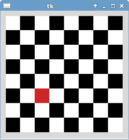</a>

### Canvas items events using current tag

### Canvas items events using ids

<a href="https://github.com/jeremiedecock/snippets/blob/master/python/tkinter/python3/canvas_items_events_using_ids.py">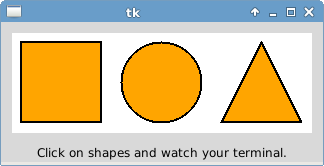</a>

### Canvas items events using tags

### Canvas screenshot

<a href="https://github.com/jeremiedecock/snippets/blob/master/python/tkinter/python3/canvas_screenshot.py">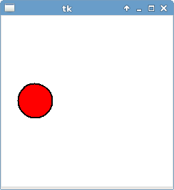</a>

### Canvas transparent shape

<a href="https://github.com/jeremiedecock/snippets/blob/master/python/tkinter/python3/canvas_transparent_shape.py">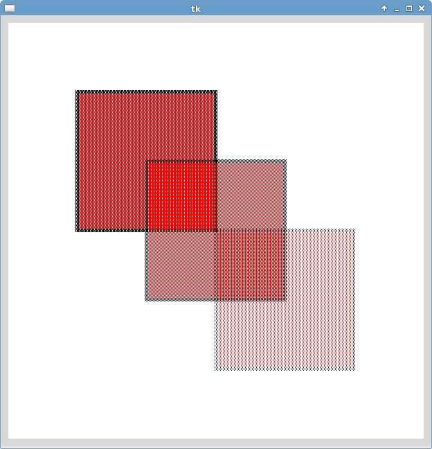</a>

### Checkbutton

<a href="https://github.com/jeremiedecock/snippets/blob/master/python/tkinter/python3/checkbutton.py">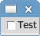</a>

### Color chooser

<a href="https://github.com/jeremiedecock/snippets/blob/master/python/tkinter/python3/color_chooser.py">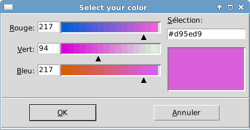</a>

### Colors

<a href="https://github.com/jeremiedecock/snippets/blob/master/python/tkinter/python3/colors.py">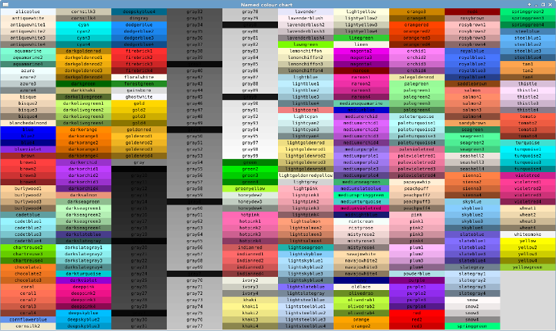</a>

### Display gif images

<a href="https://github.com/jeremiedecock/snippets/blob/master/python/tkinter/python3/display_gif_images.py">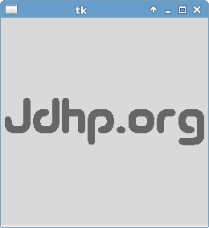</a>

### Display png images

<a href="https://github.com/jeremiedecock/snippets/blob/master/python/tkinter/python3/display_png_images.py">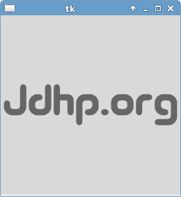</a>

### Entry

<a href="https://github.com/jeremiedecock/snippets/blob/master/python/tkinter/python3/entry.py">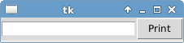</a>

### Event configure resize widget

### Event delete window

<a href="https://github.com/jeremiedecock/snippets/blob/master/python/tkinter/python3/event_delete_window.py">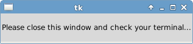</a>

### Event keyboard move shape in canvas

<a href="https://github.com/jeremiedecock/snippets/blob/master/python/tkinter/python3/event_keyboard_move_shape_in_canvas.py">event_keyboard_move_shape_in_canvas.py</a>

### Event mouse

<a href="https://github.com/jeremiedecock/snippets/blob/master/python/tkinter/python3/event_mouse.py">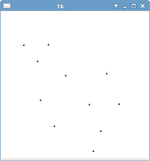</a>

### Event mouse draw polygon on canvas

<a href="https://github.com/jeremiedecock/snippets/blob/master/python/tkinter/python3/event_mouse_draw_polygon_on_canvas.py">event_mouse_draw_polygon_on_canvas.py</a>

### Fake table

<a href="https://github.com/jeremiedecock/snippets/blob/master/python/tkinter/python3/fake_table.py">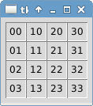</a>

### File dialog open directory

<a href="https://github.com/jeremiedecock/snippets/blob/master/python/tkinter/python3/file_dialog_open_directory.py">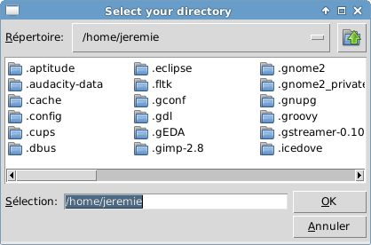</a>

### File dialog open in entry

### File dialog open multiple file descriptor

### File dialog open multiple file path

<a href="https://github.com/jeremiedecock/snippets/blob/master/python/tkinter/python3/file_dialog_open_multiple_file_path.py">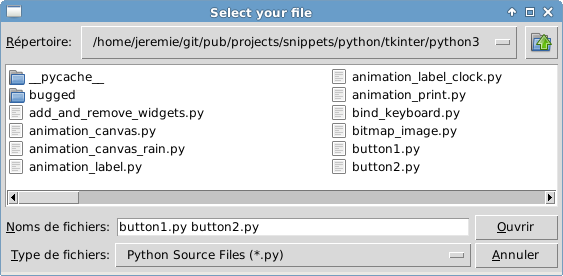</a>

### File dialog open single file descriptor

### File dialog open single file path

<a href="https://github.com/jeremiedecock/snippets/blob/master/python/tkinter/python3/file_dialog_open_single_file_path.py">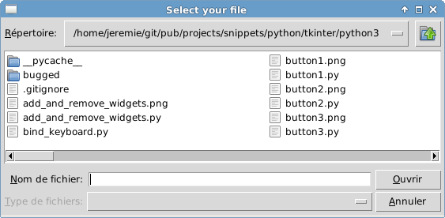</a>

### File dialog save file descriptor

<a href="https://github.com/jeremiedecock/snippets/blob/master/python/tkinter/python3/file_dialog_save_file_descriptor.py">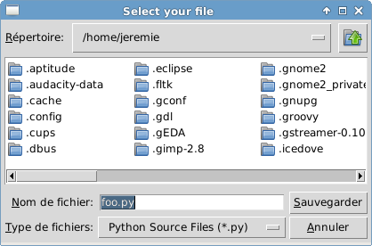</a>

### File dialog save file path

### Font

<a href="https://github.com/jeremiedecock/snippets/blob/master/python/tkinter/python3/font.py">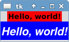</a>

### Frame as separator

<a href="https://github.com/jeremiedecock/snippets/blob/master/python/tkinter/python3/frame_as_separator.py">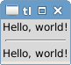</a>

### Frame styles

### Frame with border

<a href="https://github.com/jeremiedecock/snippets/blob/master/python/tkinter/python3/frame_with_border.py">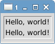</a>

### Frame without border

<a href="https://github.com/jeremiedecock/snippets/blob/master/python/tkinter/python3/frame_without_border.py">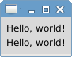</a>

### Full application template

<a href="https://github.com/jeremiedecock/snippets/blob/master/python/tkinter/python3/full_application_template.py">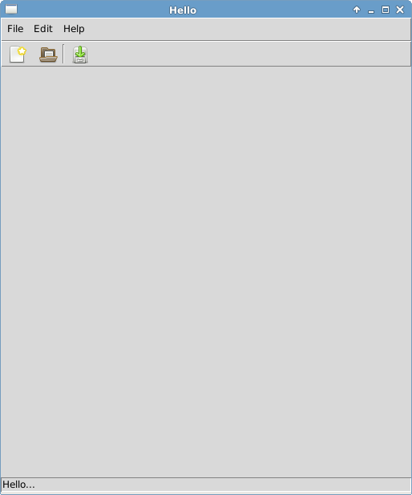</a>

### Fullscreen

<a href="https://github.com/jeremiedecock/snippets/blob/master/python/tkinter/python3/fullscreen.py">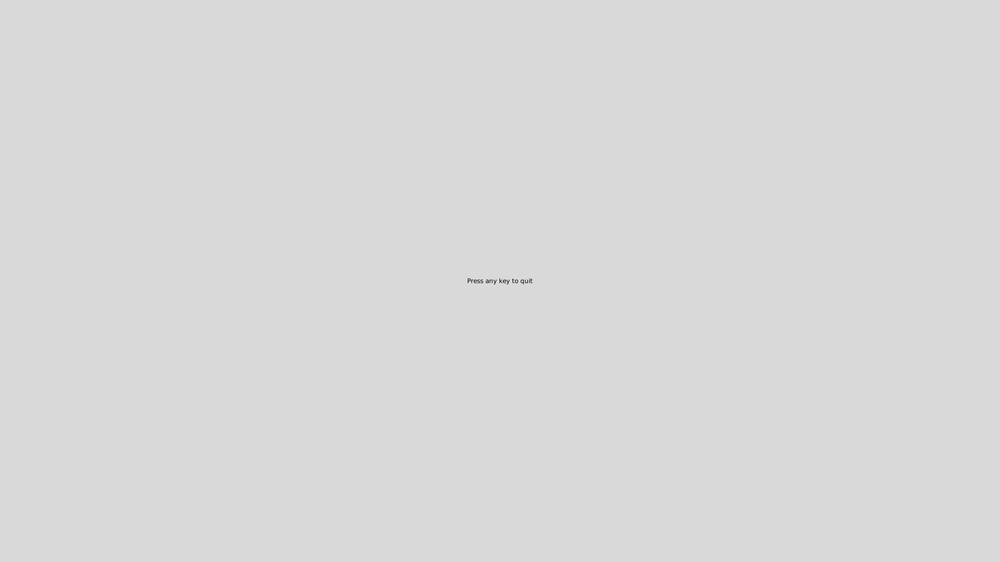</a>

### Geometry manager grid

<a href="https://github.com/jeremiedecock/snippets/blob/master/python/tkinter/python3/geometry_manager_grid.py">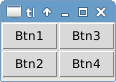</a>

### Geometry manager grid 2

<a href="https://github.com/jeremiedecock/snippets/blob/master/python/tkinter/python3/geometry_manager_grid_2.py">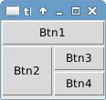</a>

### Geometry manager pack info

<a href="https://github.com/jeremiedecock/snippets/blob/master/python/tkinter/python3/geometry_manager_pack_info.py">geometry_manager_pack_info.py</a>

### Geometry manager pack left right

<a href="https://github.com/jeremiedecock/snippets/blob/master/python/tkinter/python3/geometry_manager_pack_left_right.py">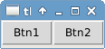</a>

### Geometry manager pack short syntax

### Geometry manager pack test with 1 widget

<a href="https://github.com/jeremiedecock/snippets/blob/master/python/tkinter/python3/geometry_manager_pack_test_with_1_widget.py">geometry_manager_pack_test_with_1_widget.py</a>

### Geometry manager pack top bottom

<a href="https://github.com/jeremiedecock/snippets/blob/master/python/tkinter/python3/geometry_manager_pack_top_bottom.py">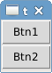</a>

### Get screens

<a href="https://github.com/jeremiedecock/snippets/blob/master/python/tkinter/python3/get_screens.py">get_screens.py</a>

### Keyboard events

<a href="https://github.com/jeremiedecock/snippets/blob/master/python/tkinter/python3/keyboard_events.py">keyboard_events.py</a>

### Keyboard events meth2

<a href="https://github.com/jeremiedecock/snippets/blob/master/python/tkinter/python3/keyboard_events_meth2.py">keyboard_events_meth2.py</a>

### Label

### Label justify

<a href="https://github.com/jeremiedecock/snippets/blob/master/python/tkinter/python3/label_justify.py">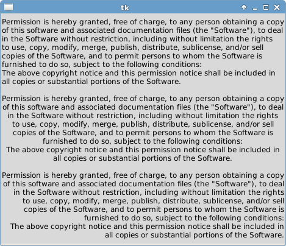</a>

### Labelframe

<a href="https://github.com/jeremiedecock/snippets/blob/master/python/tkinter/python3/labelframe.py">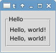</a>

### Listbox

<a href="https://github.com/jeremiedecock/snippets/blob/master/python/tkinter/python3/listbox.py">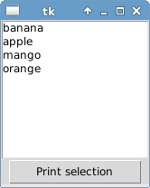</a>

### Listbox with object items

<a href="https://github.com/jeremiedecock/snippets/blob/master/python/tkinter/python3/listbox_with_object_items.py">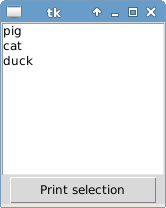</a>

### Listbox with scrollbar

<a href="https://github.com/jeremiedecock/snippets/blob/master/python/tkinter/python3/listbox_with_scrollbar.py">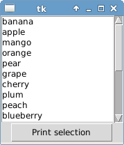</a>

### Macosx startup focus workaround

<a href="https://github.com/jeremiedecock/snippets/blob/master/python/tkinter/python3/macosx_startup_focus_workaround.py">macosx_startup_focus_workaround.py</a>

### Macosx startup focus workaround v2

<a href="https://github.com/jeremiedecock/snippets/blob/master/python/tkinter/python3/macosx_startup_focus_workaround_v2.py">macosx_startup_focus_workaround_v2.py</a>

### Matplotlib canvas using class

<a href="https://github.com/jeremiedecock/snippets/blob/master/python/tkinter/python3/matplotlib_canvas_using_class.py">matplotlib_canvas_using_class.py</a>

### Matplotlib canvas using class and toolbar

<a href="https://github.com/jeremiedecock/snippets/blob/master/python/tkinter/python3/matplotlib_canvas_using_class_and_toolbar.py">matplotlib_canvas_using_class_and_toolbar.py</a>

### Matplotlib canvas using class and toolbar and keyboard events

<a href="https://github.com/jeremiedecock/snippets/blob/master/python/tkinter/python3/matplotlib_canvas_using_class_and_toolbar_and_keyboard_events.py">matplotlib_canvas_using_class_and_toolbar_and_keyboard_events.py</a>

### Matplotlib canvas with animation

<a href="https://github.com/jeremiedecock/snippets/blob/master/python/tkinter/python3/matplotlib_canvas_with_animation.py">matplotlib_canvas_with_animation.py</a>

### Matplotlib canvas with navigation toolbar

<a href="https://github.com/jeremiedecock/snippets/blob/master/python/tkinter/python3/matplotlib_canvas_with_navigation_toolbar.py">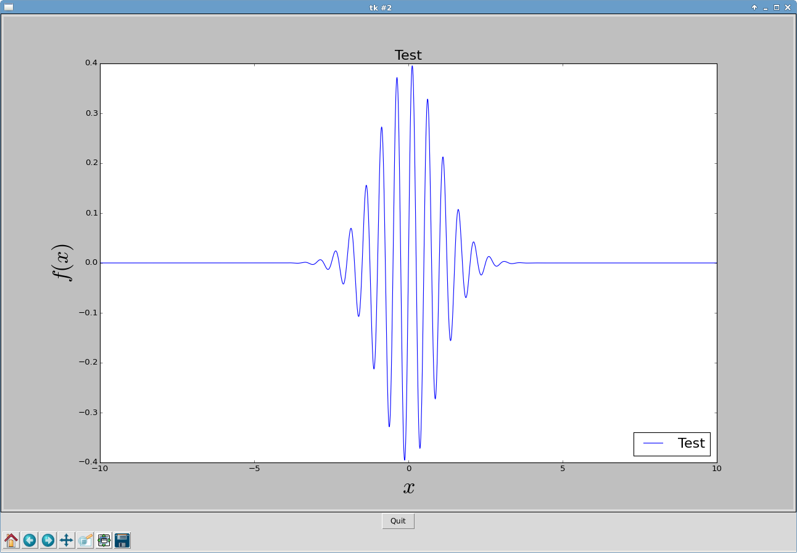</a>

### Matplotlib canvas with widgets interactions

<a href="https://github.com/jeremiedecock/snippets/blob/master/python/tkinter/python3/matplotlib_canvas_with_widgets_interactions.py">matplotlib_canvas_with_widgets_interactions.py</a>

### Matplotlib canvas without navigation toolbar

<a href="https://github.com/jeremiedecock/snippets/blob/master/python/tkinter/python3/matplotlib_canvas_without_navigation_toolbar.py">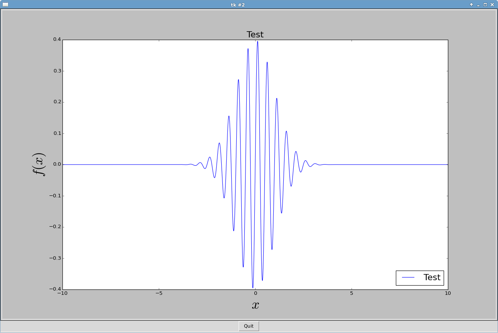</a>

### Menu checkbutton

<a href="https://github.com/jeremiedecock/snippets/blob/master/python/tkinter/python3/menu_checkbutton.py">menu_checkbutton.py</a>

### Menu enable disable items

<a href="https://github.com/jeremiedecock/snippets/blob/master/python/tkinter/python3/menu_enable_disable_items.py">menu_enable_disable_items.py</a>

### Menu popup

<a href="https://github.com/jeremiedecock/snippets/blob/master/python/tkinter/python3/menu_popup.py">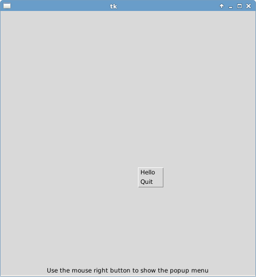</a>

### Menu pulldown

### Menu radiobutton

<a href="https://github.com/jeremiedecock/snippets/blob/master/python/tkinter/python3/menu_radiobutton.py">menu_radiobutton.py</a>

### Menu toplevel

### Messagebox

<a href="https://github.com/jeremiedecock/snippets/blob/master/python/tkinter/python3/messagebox.py">messagebox.py</a>

### Minimal

### Multiple windows

### Optionmenu

### Paned window horizontal

### Paned window vertical

### Pil

### Radiobutton

### Radiobutton factorized

### Scale horizontal

### Scale vertical

### Scrolled text

### Show and resize image with pil

### Spinbox range

### Spinbox tuple

### Text

### Text insert

### Text readonly

### Title

### Tk version

<a href="https://github.com/jeremiedecock/snippets/blob/master/python/tkinter/python3/tk_version.py">tk_version.py</a>

### Tk version window

### Ttk label

### Unicode

### Variables

<a href="https://github.com/jeremiedecock/snippets/blob/master/python/tkinter/python3/variables.py">variables.py</a>

### Window attributes topmost

### Window set fixed size

### Window set min size

<a href="https://github.com/jeremiedecock/snippets/blob/master/python/tkinter/python3/window_set_min_size.py">window_set_min_size.py</a>

### Window set size

## Some applications using Tkinter

- IDLE (Python's official IDE)

## Books

- "Tkinter GUI Application Development HOTSHOT" Bhaskar Chaudhary (Packt Publishing Ltd) 2013
- "Programming Python (4th edition)" Mark Lutz (O'Reilly Media) 2010

## Tkinter widget list

Here is a non-exhaustive list of Tkinter widgets:

- Label
- Button
- Frame
- Message
- Entry
- Checkbutton
- Radiobutton
- Scale
- PhotoImage
- BitmapImage
- Menu
- Menubutton
- Scrollbar
- Listbox
- Text
- Canvas
- OptionMenu
- PanedWindow
- LabelFrame
- Spinbox
- ScrolledText
- Dialog

